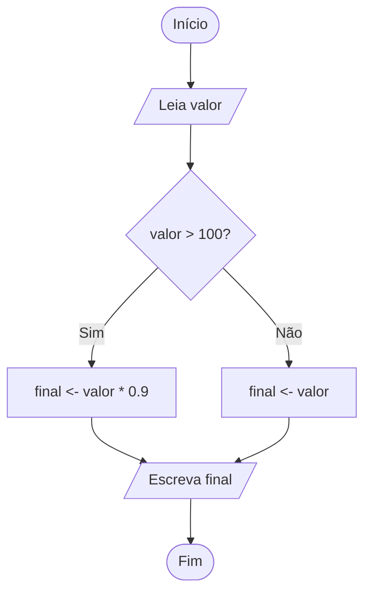

 Exercício 3 — Fluxograma (desconto de 10%)

Problema: uma loja dá desconto de 10% para compras acima de R$ 100.
Leia o valor da compra e mostre o valor final a pagar.

```mermaid
flowchart TD
    A([Início]) --> B[/Leia valor/]
    B --> C{valor > 100?}
    C -- Sim --> D[final <- valor * 0.9]
    C -- Não --> E[final <- valor]
    D --> F[/Escreva final/]
    E --> F
    F --> G([Fim])
```